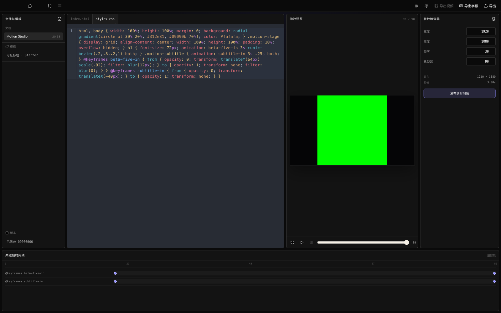
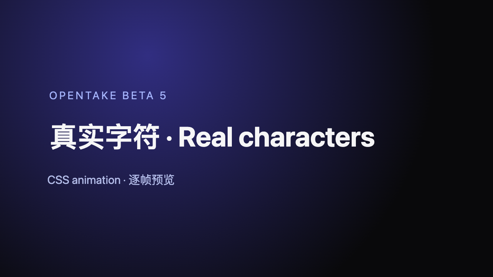

# OpenTake Beta 5 Motion Studio 验证记录

日期：2026-08-14（Asia/Shanghai）

分支：`release/v1.0.0-beta.5`

验证基线：`354cd71 feat(agent): edit Motion Studio documents with hash-safe tools`

## 结论

Motion Studio 的真实字符渲染、CSS 动画逐帧预览、项目内文档持久化、发布/重开、取消无副作用、Agent 哈希安全协作与许可证门禁均已由自动化测试和真实 Chromium/FFmpeg 路径验证通过。

本次环境没有可用的 macOS 桌面控制能力，因此没有声称完成“对打包后的 Tauri 应用做自动点击”这一项。界面结构、编辑与逐帧操作在浏览器壳层中做了可视检查；原生渲染、媒体发布、工程重开及取消语义由实际 Rust Chromium/FFmpeg 集成测试覆盖。浏览器壳层的绿色预览占位图没有作为渲染证据，预览截图由生产 `HeadlessChromiumRenderer` 直接生成。

## 可视工作流

在 1600×1000 视口进入 Motion Studio 后完成以下操作：

1. 新建工程并从一级导航进入“动效工作台”。
2. 在 `index.html` 写入中英文真实字符：

   ```html
   <main class="motion-stage">
     <p class="motion-kicker">OpenTake Beta 5</p>
     <h1>真实字符 · Real characters</h1>
     <p class="motion-subtitle">CSS animation · 逐帧预览</p>
   </main>
   ```

3. 在 `styles.css` 写入径向渐变场景和 `beta-five-in`、`subtitle-in` 两段关键帧动画。
4. 在时间线上看到两个关键帧条目，并从第 0 帧切到第 89 帧；界面读数为 `90 / 90`。
5. 无障碍树确认存在主区域“动效工作台”、区域“HTML 与 CSS 编辑器”、区域“动效预览”、播放控制组、帧滑块、检查器和关键帧时间线。

界面全景：



生产 Chromium 在第 60 帧渲染的 1280×720 真实预览：



文件校验：

```text
motion-studio-editor.png   1600×1000 RGB PNG
SHA-256 c808bd9b290df3a49c0b021827ccbffe3121efbd05bd7d88b42c044cefb90501

motion-studio-preview.png  1280×720 RGBA PNG
SHA-256 06ba67b1f537d80112d5e0edd88f412b84e5c34c9b7455157cad87953d31e60b
```

## 原生渲染、发布与取消

`src-tauri/tests/motion_integration.rs` 通过真实 Chromium 与 FFmpeg 验证完整路径：

- 生成包含“真实字符 Real text”和 CSS `@keyframes` 的逐帧画面；开始、中间和结束帧像素不同。
- 发布结果含真实字形/场景像素，而不是空画面或占位图。
- 添加后编辑同一 Motion 文档，保持 clip 身份并原子替换媒体。
- 保存并重新打开 `.opentake` 工程后，timeline、media 和代表帧像素与保存前一致。
- 第二次发布在已取消 token 下返回 `Cancelled`，前后 timeline 与 media 快照完全相同，没有新条目。
- 非法尺寸被拒绝且同样不改变工程。

执行证据：

```text
OPENTAKE_RUN_FFMPEG_TESTS=1 cargo test -p opentake-tauri --test motion_integration -- --nocapture
1 passed

cargo test -p opentake-tauri --test motion_command -- --nocapture
1 passed
```

## Agent 协作与冲突

Agent/MCP 与 Web store 回归覆盖：

- Agent 创建文档、读取权威 revision hash，并以 UTF-8 字节编辑写入中文内容。
- patch 必须携带精确 baseline hash；过期 hash 返回结构化、非变更的 revision conflict。
- 编辑器干净时安装 Agent 权威 revision；本地 dirty/saving/conflict/publishing 时保留本地内容并进入显式冲突处理，不静默覆盖。
- 发布期间到达的新 Agent revision 会排队，并在发布终态后按项目身份重新读取。
- create/patch/preview/publish 都绑定 IPC 接收时的项目 authority；Save As/Open 造成身份变化时取消旧项目操作。
- 文档 ID、尺寸、帧数、源文件大小和结果大小均有严格边界；Agent 结果不包含文件系统路径。

对应最终门禁：

```text
cargo test -p opentake-agent mcp::
191 passed

cargo test -p opentake-tauri motion_documents::tests --lib
17 passed

cargo test -p opentake-tauri mcp::tests --lib
83 passed

pnpm -C web exec vitest run src/components/motion/MotionCodeEditor.test.tsx \
  src/components/motion/MotionStudio.interaction.test.tsx \
  src/components/motion/MotionStudio.test.tsx \
  src/components/motion/MotionTimeline.test.ts \
  src/store/motionStudioStore.test.ts
5 files / 39 tests passed
```

## Motion 与许可证门禁

```text
cargo test -p opentake-motion --lib -- --nocapture
62 passed

cargo test -p opentake-motion --all-features
97 unit tests passed

cargo test -p opentake-motion --all-features --test chromium \
  -- --nocapture --test-threads=1
7 passed; 4K opaque 5.801 s, transparent 9.077 s

python3 -B -m unittest scripts/test_check_license_inventory.py
7 passed

python3 -B scripts/check_license_inventory.py
passed

pnpm -C web licenses list --prod
passed; CodeMirror production packages resolve to their recorded MIT licenses

pnpm -C web test
149 files / 1365 tests passed

pnpm -C web build
passed; only the existing dynamic-import and large-chunk warnings remain

git diff --check
passed
```

第一次并行运行 live Chromium 集成时，4K opaque 帧完成后 transparent 用例在 180 秒超时，并使同一共享 gate 后续用例被 poison。4K 用例独立复跑通过（opaque 5.941 秒、transparent 9.469 秒），随后完整 Chromium 集成改为单线程复跑，7/7 在 39.74 秒内通过。该现象记录为测试并发资源争用，不被隐藏为一次全绿运行。

CodeMirror 依赖、解析出的精确版本、仓库来源与安装包内 MIT 许可证由 `scripts/check_license_inventory.py` 交叉校验；修改或删除任一清单项的 mutation tests 均会 fail closed。

## 覆盖边界

- 已验证：真实 Chromium 字符/CSS 动画、逐帧寻址、FFmpeg 发布、代表帧像素、保存重开、取消不提交、Agent stale-hash 冲突、项目切换隔离、Web 可视结构及许可证。
- 未声称：本机打包 App 的自动鼠标/键盘点击录制。当前会话没有可用的 desktop-control skill/tool；浏览器壳层也不提供原生 Chromium PNG，因此其绿色占位预览已被真实生产渲染截图替换。
- 发布包安装、签名、公证、DMG 哈希和 GitHub 资产上传属于最终 Beta 5 候选包流程，不由本审计记录代替。
